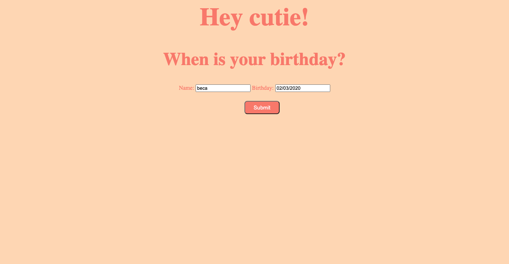
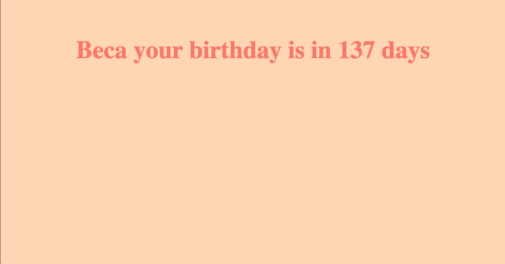
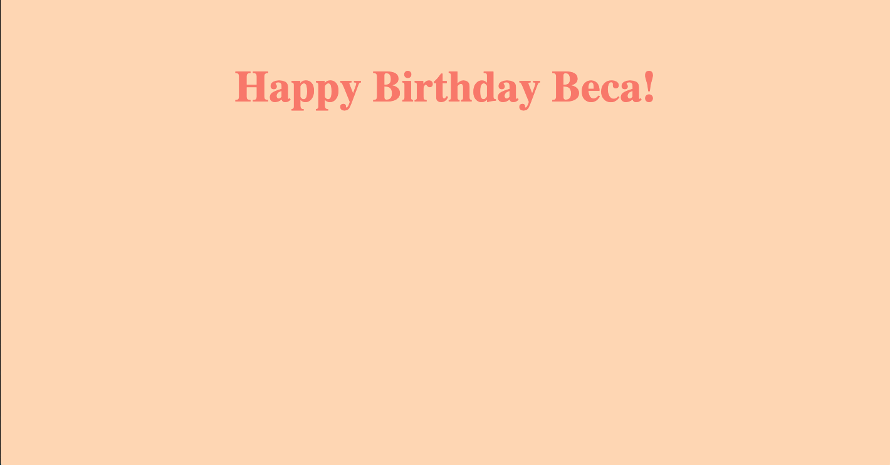

# Happy Birthday App

Your challenge is to build a web app that will ask the user for a name and birthday.

When the user submits the form, and depending on the current date, the app will either:
- wish the user happy birthday
- tell them how long they'll have to wait until their next birthday

## Views from app:

    
-------
    
-------
    

